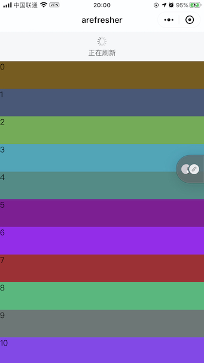
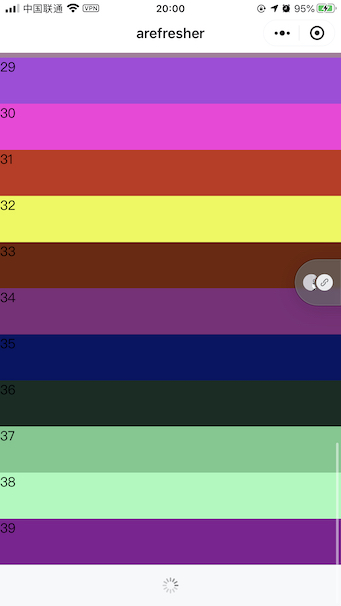

# arefresher-weapp
微信小程序“下拉刷新”，“上拉加载更多”组件。采用WXS处理触摸和滚动事件，使用体验媲美官方组件。

[GitHub太卡，可访问国内镜像](https://gitee.com/abram-lin/arefresher-weapp)





## 参数解释

### 组件属性

| 字段             | 类型                     | 必填 | 描述                                        |
| --------------- | ------------------------| ---- | ------------------------------------------  |
|height           | Number                  | 否   | 组件高度                                     |
|upperThreshold   | Number                  | 否   | 触发刷新的下拉阈值，默认80                      |
|lowerThreshold   | Number                  | 否   | 触发加载更多的阈值，默认30                      |
|refreshText      | String                  | 否   | 下拉刷新显示文本，默认为“下拉刷新”               |
|noMoreText       | String                  | 否   | 数据加载完时的显示文本，默认“数据已全部加载”       |
|empty            | Boolean                 | 是   | 是否无数据，无数据时不显示底部”加载更多“          |

## 使用方法

通过下面方式获取组件实例对象。

``` JavaScript
// 获取组件实例对象
this.arefresher = this.selectComponent('#id');
```

- 下拉刷新触发后，调用下面方法停止刷新

``` JavaScript
// 停止下拉刷新
this.arefresher.stopRefresh();
```

- 加载更多完成时，调用下面方法通知组件

``` JavaScript
// 停止加载更多
this.arefresher.stopLoadMore();
```

- 数据已全部加载，调用

``` JavaScript
// 已全部加载
this.arefresher.setNoMore();
```

- 数据为空时，设置组件 `empty` 属性为 `ture`